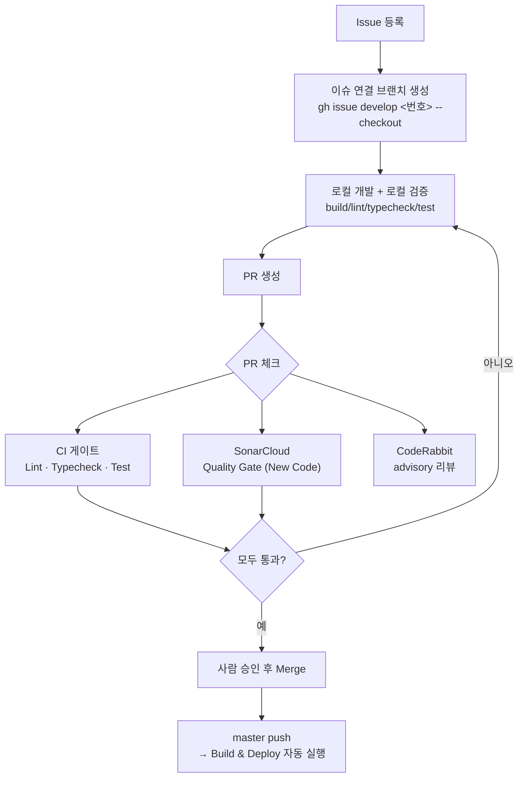
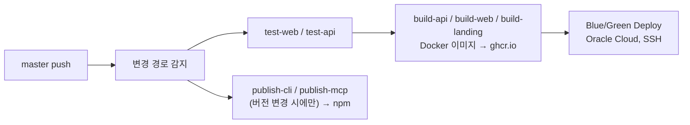

# 개발 & 배포 프로세스

ERDify 저장소에서 기능을 개발하고 master에 반영하기까지의 흐름입니다.

## 전체 흐름



## 1. 이슈 → 브랜치 → PR

```bash
gh issue create --title "..." --body "..."
gh issue develop <이슈번호> --base master --checkout   # 이슈 연결 브랜치 생성 + 체크아웃

# 개발 + 로컬 검증
pnpm build && pnpm lint && pnpm typecheck && pnpm test

git add <파일> && git commit -m "..."
git push -u origin HEAD
gh pr create --base master --title "..." --body "... Closes #<이슈번호>"
```

- 브랜치는 항상 이슈에서 생성 (`gh issue develop`) — PR과 이슈가 자동으로 연결됩니다.
- 커밋 메시지/PR 본문에 `Closes #N`을 넣으면 머지 시 이슈가 자동으로 닫힙니다.

## 2. PR 체크 — 역할 분담

같은 PR에 여러 체크가 동시에 붙지만 역할이 다릅니다.

| 체크 | 역할 | 실패 시 |
|---|---|---|
| **Lint · Typecheck · Test** (`.github/workflows/ci.yml`) | 워크스페이스 전체 build/lint/typecheck/test(+coverage) 게이트 | 머지 차단 (required) |
| **SonarCloud Code Analysis** | 정적분석 + Quality Gate(New Code 기준) + 커버리지 | 머지 차단 (required) |
| **CodeRabbit** | AI 코드 리뷰 (로직/설계/엣지케이스 중심) | 머지 차단 안 함 (advisory) |
| **test** (`test.yml`) | 텔레그램 알림용 (`continue-on-error`) | 항상 통과, 참고용 |

- **CI 게이트**와 **SonarCloud**만 [master branch protection](https://github.com/cartoonpoet/ERDify/settings/branches)의 required status check로 등록되어 있어 실제로 머지를 막습니다.
- **CodeRabbit**은 의도적으로 advisory — 정적분석 수준 지적(복잡도/중복/시크릿)은 SonarCloud가 담당하도록 `.coderabbit.yaml`에서 역할을 나눴습니다. 리뷰 코멘트는 판단해서 반영하거나 논의로 남깁니다.
- SonarCloud Quality Gate는 **New Code** 기준입니다 — 기존 코드에 남아있는 이슈 때문에 무관한 PR이 막히지 않고, 이번에 건드린 코드만 깨끗하면 됩니다.

## 3. Branch protection (master)

- Required checks: `Lint · Typecheck · Test`, `SonarCloud Code Analysis`
- `strict: true` — 머지 전 브랜치가 최신 master 기준이어야 함 (뒤처져 있으면 `git merge origin/master` 또는 GitHub UI의 "Update branch")
- force-push, 브랜치 삭제 금지

## 4. 배포 (master merge 이후)

master에 push되면 `.github/workflows/deploy.yml`이 **별도로, 자동으로** 실행됩니다 (CI 게이트와 독립적인 워크플로우 — CI가 이미 PR 단계에서 막았다는 전제 하에 동작).



- 경로 기반 감지(`dorny/paths-filter`)로 실제로 바뀐 앱만 빌드·배포합니다 (예: `apps/web`만 고쳤으면 api 이미지는 다시 안 만듦).
- CLI/MCP 서버는 `package.json` 버전이 올라간 경우에만 npm publish됩니다.

## 로컬 개발 명령어

```bash
pnpm build              # 전체 패키지 빌드
pnpm lint               # 전체 패키지 ESLint
pnpm typecheck          # 전체 패키지 tsc --noEmit
pnpm test               # 전체 패키지 Vitest
pnpm test:coverage      # 전체 패키지 Vitest + 커버리지(lcov) — SonarCloud가 사용하는 것과 동일
```

CI에서 도는 파이프라인과 로컬 명령어가 1:1로 대응하므로, PR 올리기 전에 로컬에서 위 4개(`build`/`lint`/`typecheck`/`test`)를 돌려보면 CI 실패를 미리 잡을 수 있습니다.
