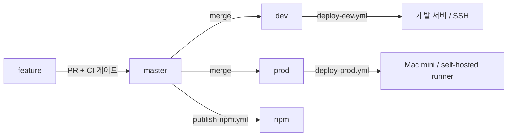

# 배포 운영 가이드

브랜치 분리 CI/CD의 설정·운영·롤백 절차입니다. 개발 흐름(이슈→PR→머지)은 [CONTRIBUTING.md](../../CONTRIBUTING.md)를 보세요.

> 이 문서에는 실제 시크릿 값을 절대 적지 않습니다. 이름과 넣어야 할 값의 성격만 기록합니다.

## 1. 브랜치 → 환경 매핑

| 브랜치 | 워크플로우 | 대상 | 실행 방식 |
|---|---|---|---|
| `master` | `publish-npm.yml` | npm (`@erdify/cli`, `@erdify/mcp-server`) | 버전이 올라간 경우에만 퍼블리시. **서버 배포 없음** |
| `dev` | `deploy-dev.yml` | 개발 서버 (Ubuntu, `/opt/erdify/repo`) | GitHub 호스티드 러너 → SSH |
| `prod` | `deploy-prod.yml` | 운영 Mac mini (`/Users/junhoson/erdify-production/repo`) | Mac mini의 self-hosted runner (인바운드 SSH 없음) |
| 모든 PR | `ci.yml`, `test.yml`, `ai-review.yml` | — | 머지 게이트 / 알림 / 리뷰 |

`master`는 더 이상 자동 배포하지 않습니다. 배포는 `master` → `dev` → (검증 후) `prod` 순으로 머지해서 진행합니다.



## 2. 이미지 태그 전략

세 이미지(`erdify-api`, `erdify-web`, `erdify-landing`)를 `ghcr.io/cartoonpoet/` 아래에 밀고, 배포마다 태그 두 개를 붙입니다.

- **이동 태그** — `dev` / `prod`. "그 브랜치의 최신"을 가리키는 편의용.
- **불변 태그** — `dev-<40자리 커밋 SHA>` / `prod-<40자리 커밋 SHA>`. **실제 배포는 항상 이 태그로** 합니다.

`latest` 하나를 dev/prod가 공유하면 한쪽 배포가 다른 쪽 이미지를 갈아끼우는 경쟁이 생깁니다. 환경별로 태그 네임스페이스가 갈리고, 배포 대상이 커밋 SHA로 고정되므로 그 경쟁이 구조적으로 불가능합니다.

한 번 배포할 때 변경 여부와 무관하게 세 이미지를 모두 빌드합니다. 바뀐 것만 빌드하면 안 바뀐 앱의 `<env>-<sha>` 태그가 레지스트리에 없어 배포가 깨지기 때문입니다. 미변경 이미지는 GHA 레이어 캐시로 거의 즉시 끝납니다.

compose는 `IMAGE_TAG` 환경변수로 태그를 받습니다(`docker-compose.app.yml`). `scripts/deploy.sh`가 export해서 넘기며, 태그를 정할 수 없으면 **추측하지 않고 실패**합니다.

## 3. GitHub 설정 (수동 작업)

### 3.1 Environments

**Settings → Environments** 에서 두 개를 만듭니다.

| Environment | 용도 |
|---|---|
| `development` | dev 배포 + dev용 web 이미지 빌드 |
| `production` | prod 배포 + prod용 web 이미지 빌드 |

`production`에는 필요에 따라 required reviewers / deployment branch 제한(`prod`만 허용)을 겁니다. required reviewers를 걸면 **이미지 빌드 잡과 배포 잡 각각** 승인을 요구한다는 점만 알아두세요(빌드 잡도 환경 시크릿을 읽기 위해 환경에 속합니다).

### 3.2 Environment secrets

`development` 환경:

| 이름 | 값 |
|---|---|
| `DEV_SSH_HOST` | 개발 서버 호스트/IP |
| `DEV_SSH_USER` | SSH 계정 (`ubuntu`) |
| `DEV_SSH_KEY` | 배포 전용 SSH 개인키 (PEM 전문) |
| `VITE_GA4_MEASUREMENT_ID` | (선택) 개발용 GA4 ID. 비우면 계측 비활성화 |
| `VITE_CLARITY_PROJECT_ID` | (선택) 개발용 Clarity ID |

`development` 환경 variables (선택): `DEV_SSH_PORT` — 기본 22.

`production` 환경:

| 이름 | 값 |
|---|---|
| `VITE_GA4_MEASUREMENT_ID` | 운영 GA4 ID |
| `VITE_CLARITY_PROJECT_ID` | 운영 Clarity ID |

운영 배포는 self-hosted runner가 수행하므로 SSH 시크릿이 **없습니다**. 이게 이 설계의 핵심입니다 — Mac mini로 들어오는 인바운드 포트를 열지 않습니다.

기존 저장소 시크릿 중 `SERVER_HOST` / `SERVER_USER` / `SSH_PRIVATE_KEY`는 더 이상 어떤 워크플로우도 참조하지 않습니다. 개발 서버 접속 정보가 맞다면 `DEV_SSH_*`로 옮긴 뒤 **삭제**하세요.

### 3.3 저장소 시크릿 (그대로 유지)

`TELEGRAM_BOT_TOKEN`, `TELEGRAM_CHAT_ID`, `NPM_TOKEN`, `SONAR_TOKEN`, `CLAUDE_CODE_OAUTH_TOKEN`, `ANTHROPIC_API_KEY`, `OPENAI_API_KEY`, `GEMINI_API_KEY`.

### 3.4 브랜치 보호

`dev` / `prod`도 `master`와 같은 required check(`Lint · Typecheck · Test`, `SonarCloud Code Analysis`)를 걸고 force-push를 막는 것을 권장합니다. 특히 `prod`는 직접 push를 막고 PR 머지만 허용하세요 — 불변 태그가 커밋 SHA에 묶여 있어 force-push는 롤백 대상 커밋을 통째로 날릴 수 있습니다.

## 4. Mac mini self-hosted runner

### 4.1 라벨

배포 잡은 `runs-on: [self-hosted, macOS, ARM64, erdify-production]` 입니다. 앞의 세 개는 러너가 자동으로 붙이고, **`erdify-production`은 등록 시 직접 추가**해야 합니다. 다른 self-hosted 러너가 운영 배포를 집어가는 사고를 막는 라벨입니다.

### 4.2 설치

**Settings → Actions → Runners → New self-hosted runner → macOS / ARM64** 에서 나오는 명령을 Mac mini의 `junhoson` 계정으로 실행합니다.

```bash
mkdir -p ~/actions-runner && cd ~/actions-runner
# (GitHub가 안내하는 curl/tar 명령으로 러너 패키지 내려받기)

./config.sh \
  --url https://github.com/cartoonpoet/ERDify \
  --token <등록 토큰> \
  --labels erdify-production \
  --name erdify-mac-mini \
  --work _work

# 로그인 세션과 함께 상시 기동
./svc.sh install
./svc.sh start
```

확인 사항:

- 러너는 **`junhoson` 계정**으로 돌아야 합니다. `/Users/junhoson/.docker/bin/docker`와 `~/.docker/config.json`(ghcr 로그인)에 접근해야 하기 때문입니다.
- Docker Desktop이 로그인 시 자동 시작되도록 켜 두세요. 배포 잡은 `docker info`가 실패하면 **아무것도 건드리지 않고** 즉시 실패합니다.
- `/Users/junhoson/erdify-production/repo`에 `.env`(mode 600)가 있어야 합니다. gitignore 대상이라 배포 중 `git clean -fd`에 지워지지 않습니다.
- 러너는 GitHub로 **아웃바운드 HTTPS만** 씁니다. 공유기에서 22번 포트를 열 필요가 없습니다.

### 4.3 재부팅 후 자동 기동

기존 `~/erdify-production/start-erdify.zsh`는 태그 없이 compose를 올리므로, 배포된 태그를 그대로 다시 띄우도록 배포 스크립트를 쓰게 바꾸는 것을 권장합니다.

```zsh
cd /Users/junhoson/erdify-production/repo
ERDIFY_TARGET=prod bash scripts/setup.sh
ERDIFY_TARGET=prod bash scripts/deploy.sh --no-pull   # 마지막 배포 태그를 상태 파일에서 읽어 기동
```

`--no-pull`은 부팅 직후 네트워크가 아직 안 붙었을 때도 로컬 이미지로 기동하기 위한 것입니다.

## 5. 배포 스크립트

`scripts/deploy.sh`는 dev/prod 양쪽에서 같은 흐름을 돕니다. 호스트별 차이는 `scripts/lib/deploy-common.sh`의 프로필 한 곳에만 있습니다.

| | dev | prod |
|---|---|---|
| 리포 | `/opt/erdify/repo` | `/Users/junhoson/erdify-production/repo` |
| 배포 상태 | `/opt/erdify/deploy-state` | `/Users/junhoson/erdify-production/deploy-state` |
| docker CLI | `sudo docker` | `/Users/junhoson/.docker/bin/docker` |
| compose 오버라이드 | 없음 | `docker-compose.mac-app.yml`, `docker-compose.mac-shared.yml` |

흐름:

1. nginx 설정 검사(`nginx -t`) 후 reload — 잘못된 설정이면 앱을 건드리기 전에 중단합니다.
2. `compose pull` → 실패하면 `up`을 시도하지 않고 종료(기존 컨테이너는 그대로 계속 서비스).
3. `compose up -d`
4. 헬스 검증 — api/web/landing 컨테이너 상태 + 컨테이너 안에서 `/api/health` 직접 호출.
5. 성공: `deploy-state/current-tag` 갱신, 이전 값은 `previous-tag`로 보존, dangling 이미지만 정리.
6. 실패: **직전 태그로 자동 롤백**한 뒤 non-zero로 종료 → 워크플로우가 빨간불이 됩니다.

**볼륨은 어떤 경로에서도 삭제하지 않습니다.** `compose down`, `volume rm`, `volume prune`, `system prune`, `--volumes`는 스크립트에 존재하지 않으며, `scripts/test/deploy-test.sh`가 이를 검증합니다. `scripts/setup.sh`도 볼륨/네트워크를 "없을 때만" 만듭니다 — `erdify_postgres_data`, `erdify_uploads`, `certbot_certs`, `certbot_webroot`는 절대 재생성되지 않습니다.

배포 상태 파일을 리포 **밖**에 두는 이유는 배포마다 `git clean -fd`가 돌기 때문입니다.

## 6. 롤백

### 6.1 자동

새 태그의 헬스 검증이 실패하면 스크립트가 스스로 `previous-tag`로 되돌리고 워크플로우를 실패시킵니다. 별도 조치가 필요 없습니다.

### 6.2 GitHub UI에서 (권장)

**Actions → Deploy — production → Run workflow** 에서 `image_tag`에 되돌릴 태그를 넣습니다.

```
prod-<되돌릴 커밋의 40자리 SHA>
```

이 경로는 테스트·빌드를 건너뛰고 **이미 레지스트리에 있는 이미지**를 배포하며, 런타임 리포도 그 커밋으로 함께 되돌립니다(compose/nginx 설정이 이미지와 어긋나지 않도록). 형식이 맞지 않는 값은 거부됩니다. dev도 `Deploy — development`에서 `dev-<sha>`로 동일하게 동작합니다.

### 6.3 호스트에서 직접

```bash
cd /Users/junhoson/erdify-production/repo
ERDIFY_TARGET=prod bash scripts/deploy.sh --rollback                  # previous-tag로
ERDIFY_TARGET=prod bash scripts/deploy.sh --rollback --tag prod-<sha> # 특정 태그로
```

배포 이력 확인:

```bash
cat /Users/junhoson/erdify-production/deploy-state/current-tag
cat /Users/junhoson/erdify-production/deploy-state/previous-tag
```

## 7. 배포 검증

워크플로우가 초록불이면 헬스 검증까지 통과한 것입니다. 수동 확인:

```bash
DOCKER=/Users/junhoson/.docker/bin/docker      # 개발 서버에서는 `sudo docker`

$DOCKER ps --format '{{.Names}}\t{{.Image}}\t{{.Status}}'
$DOCKER exec erdify-api-1 wget -q -O - http://localhost:4000/api/health
$DOCKER exec erdify-shared-nginx-1 nginx -t
$DOCKER logs --tail 100 erdify-api-1
```

`erdify-api-1`은 이미지에 정의된 HEALTHCHECK 덕분에 `(healthy)`로 표시되어야 합니다. `docker ps`의 이미지 태그가 `deploy-state/current-tag`와 일치하는지도 함께 봅니다.

## 8. DB 백업

배포는 DB를 건드리지 않지만(마이그레이션은 API 컨테이너 진입점에서 실행), 스키마가 바뀌는 배포 전에는 백업을 권장합니다.

```bash
/Users/junhoson/.docker/bin/docker exec erdify-shared-postgres-1 sh -lc \
  'pg_dump -U "$POSTGRES_USER" -d "$POSTGRES_DB" -Fc --no-owner --no-acl' \
  > "/Users/junhoson/erdify-migration/backups/erdify-$(date +%Y%m%d-%H%M%S).dump"
```

## 9. 배포 도구 자체를 고칠 때

배포 스크립트는 배포 순간에야 실행되므로, PR 단계에서 `ci.yml`의 `Deploy Scripts · shellcheck · test` 잡이 막습니다.

```bash
shellcheck -x scripts/deploy.sh scripts/setup.sh scripts/lib/deploy-common.sh
bash scripts/test/deploy-test.sh   # 가짜 docker로 배포/롤백/헬스 실패 경로 검증
```

`scripts/test/deploy-test.sh`는 `scripts/test/fake-docker.sh`를 PATH에 `docker`로 심어 실제 도커 없이 돕니다. 배포 스크립트에 분기를 추가하면 이 파일에 케이스를 함께 추가하세요.

## 범위 밖

도메인/DNS 설정은 이 파이프라인이 건드리지 않습니다. 인증서(`certbot_certs`)와 nginx의 `server_name`도 기존 값을 그대로 씁니다.
